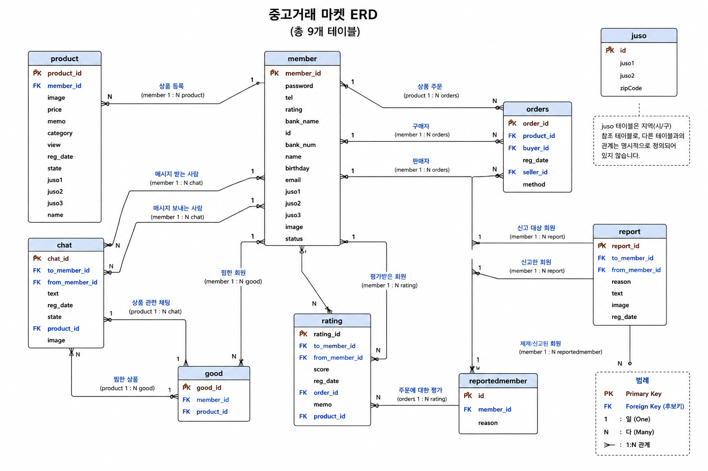

# re:pick 중고거래 사이트

## 프로젝트 소개

- 사용자가 중고 상품을 등록하고 거래할 수 있는 웹사이트입니다.
- 제작 목적 : Git을 사용한 협업 능력 강화 및 프론트엔드, 백엔드 개발 역량 향상

## 주요 기능
- 회원가입 및 로그인, 비밀번호 찾기
- 회원정보 수정
- 상품 등록, 수정 및 삭제
- 상품 검색 및 카테고리, 지역 검색
- 상품 조회 및 상세보기
- 찜 기능
- 신고 기능
- 채팅 기능
- 관리자 회원 관리 및 신고 관리

## 기술 스택
- Frontend: HTML, CSS, JavaScript, Bootstrap
- Backend: PHP
- Database: MariaDB
- Server: Apache
- Collaboration: Git, Github

## 팀원 및 역할
| GitHub ID | 역할 |
| @sjun10290801 | Backend 전체 개발, JavaScript 기능 구현
| @moongchitory | Frontend 개발
| @woo0303 | Frontend 개발

## ERD

